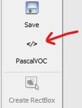
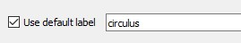
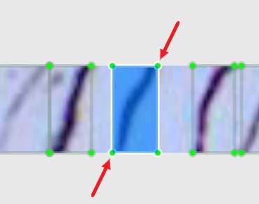

# Evaluating SSCD's performance

### Overview

Here we provide a guide for evaluating the performance of the Salmon Scale Circuli Detector (SSCD) on new, unseen to training, images. SSCD is composed by two distinct object detection models, the **focus** and the **circulus** detectors, and evaluation must therefore be carried separately for each detector.

Performance evaluation is based on geometric-based comparisons between detections and *ground truth* data (also referred to as annotations). In the context of object detection, ground truths consist of (manually) marked bounding boxes delimiting target objects in images.

This guide assumes the detection step has been already carried out (using the [`sscd.py`](../README.md#how-to-run-sscd)  function), and the goal now is to assess the performance of one of the detectors on a set of images used in detection. Obtained evaluation metrics can then be contrasted with those observed when the detector was last trained. Considerable drops (>10%) in metrics provide a strong indication that the detector's expected prediction accuracy has declined, and therefore it should be retrained with fresh images.

The following table provides the evaluation metrics of each detector obtained on the test set at the time of the latest training.

###### Evaluation metrics on test set on latest training
| Model            | Training date  | No. of images  | IOU<sub>Thresh</sub> | Average Precision (AP) | F<sub>1</sub>   |
|------------------|----------------|----------------|----------------------|------------------------|-----------------|
| Focus detector   | July 2020      | 103            |  0.5                 | 99.0%                  | 0.99            |
| Circulus detector| December 2020  | 81             |  0.5                 | 95.2%                  | 0.94            |


An important caveat in the evaluation process is the quality of the annotation data:

  - Labelling, the process by which ground truths are generated, needs to be as accurate and consistent as possible.

  - Labelling circulus, in particular, may at times be challenging as identifying circuli bands can be ambiguous due to e.g. packed bands (specially on river growth), poor scale-to-slide imprinting or the occurrence of fissures/discontinuities in scale deposition.

  - Poor quality annotation data will have a negative impact on performance metrics while the detector is still operating at expected levels of accuracy, potentially prompting the user to needlessly retrain the detector.

  - Visual inspection of detections vs annotations plots could help to discern decay in the detector's performance from poor labelling.


#### Annotation tools

- There is a [panoply][1] of annotation tools available for labelling objects in images.

- For its simplicity, speed and ease of use, we recommend [*LabelImg*][2]. Installation instructions are described [here][4].

>Note: the evaluation tool expects annotation files to be in Pascal VOC format. Thus, if using a different annotation software  without the option of Pascal VOC as an output format, annotations will need to be converted accordingly (e.g. this [python package][3] offers a range of format conversions).


## Evaluation walkthrough example

  - In order to proceed with this example, it is assumed that:
    1. Detection has already been run on a set of images via the `sscd.py` interface.
    2. *LabelImg* has been correctly installed.


  - During the detection step, jpg images of scales and transects used in detection are stored in the subdirectory `<detections_output_dir>\jpegs`.

  - The example described here refers to the evaluation of the circulus detector.

  - To evaluate the performance of the focus detector, specify directory paths and labels' class name (`focus`) accordingly.


### 1. Setting-up directories and files to use in evaluation

- Create a main directory to comprise the files required for the evaluation process (e.g. `<some_path>/eval_circuli_detector`)

- Select and copy the images to be used in the evaluation from the directory containing the transect images generated during detection (`<detections_output_dir>/jpegs/transects`) to a dedicated subdirectory (e.g. `<some_path>/eval_circuli_detector/imgs`).

- Create a new subdirectory to take the annotation files (e.g. `<some_path>/eval_circuli_detector/anns`)

- Optionally, for easier reference, copy the circuli detection data (`<detections_output_dir>/detections/circuli/detections.csv`) to the main directory created above (i.e. `<some_path>/eval_circuli_detector/detections.csv`)


### 2. Label the images

- Open an Anaconda Prompt, go to the *LabelImg* directory and launch it

  ```
  python labelImg.py
  ```

- Go to `File > Open Dir` and select the images' directory (here, `<some_path>/eval_circuli_detector/imgs`)

- Go to `File > Change Save Dir`  (or `Ctrl + r`) and select the annotations directory (here, `<some_path>/eval_circuli_detector/anns`)

- Make sure the PascalVOC option is selecte

  

- On the righthand side panel, tick the box "use default label" and type `circulus` on the adjacent text box

  


- Proceed with the labelling process, using the mouse to delimit rectangular boxes around **every target object** (the circulus in this case) present in each image
  - It is **critical** that each bounding box delimits the <ins>entirety</ins> of the target object in the image as accurately as possible, as exemplified below for labelling circuli

  

  - Useful [hotkeys](https://github.com/tzutalin/labelImg#hotkeys) include:
    - `w` - create a new box
    - `Ctrl + d` - duplicate the current box. Useful for speeding up the process in images with high density of target objects (e.g. circuli in scale transects)
    - `Ctrl + s` - save annotations for current image
    - `d` - move to next image
    - `↑→↓←` - keyboard arrows: adjust position of selected box
    - `Ctrl + u` - load images from a directory
    - `Ctrl + r` - Set directory comprising the annotation files

### 3. Run evaluation (in a jupyter session)

- Open an Anaconda prompt and navigate to the SSCD directory

- Activate the SSCD environment:

  ```
  > conda activate sscd
  ```

- Launch Jupyter lab:

  ```
  > jupyter lab
  ```

- Run the following code on a notebook, **using the appropriate paths and directory names**

  ```
  %run eval_detector.py \
      --img_dir "<some_path>/eval_circuli_detector/imgs" \
      --anns_dir "<some_path>/eval_circuli_detector/anns" \
      --dets_csv "<some_path>/eval_circuli_detector/detections.csv" \
      --iou_threshould 0.5 \
      --output_dir "<some_path>/eval_circuli_detector/" \
      --plot_dets_vs_anns True \
      --sep_plots True
  ```


[1]: https://www.simonwenkel.com/2019/07/19/list-of-annotation-tools-for-machine-learning-research.html
[2]: https://github.com/tzutalin/labelImg#labelimg
[3]: https://github.com/monocongo/cvdata
[4]: https://github.com/tzutalin/labelImg#windows--anaconda
